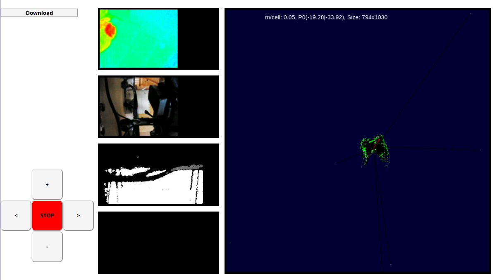

<a href="https://107-systems.org/"></a>
:floppy_disk: `l3xz-mapping`
============================
This repository includes the ROS-based explorative mapping stack of L3X-Z for Elrob 2022.

The stack consists of two parts tested under ROS1 Noetic Ninjemys. Part one runs on a base station, does the mapping using RTAB-Map, data logging and comes with a browser frontend. Part two can be deployed to the Raspberry Pi on the robot. It's purpose is to read all the sensor data and transmit it to part one. 

# Setup

## Part 1 (the base station part)
Clone the repository and go to host root:
~~~bash
git@github.com:107-systems/l3xz-mapping.git
cd l3xz-mapping/host
~~~
Build the docker container:
~~~bash
sudo ./build_docker.sh
~~~
Start the docker container:
~~~bash
sudo ./start_docker.sh
~~~
A tmux session will appear, the software base is automatically built and executed.

## Part 2 (the robot part)
Install the Realsense ROS enviroment:
~~~bash
sudo apt-get install ros-noetic-realsense2-camera
~~~
Clone the repository and go to client root:
~~~bash
git@github.com:107-systems/l3xz-mapping.git
cd l3xz-mapping/client
~~~
To establish a connection to the base station with the ROS master, edit the base station IP-Address in ```master_ip.conf```.
Finally, we can start the robot part:
~~~bash
./start.sh
~~~
A tmux session will appear. After the software is built automatically, the sensor nodes will be started.

## Start mapping
After both parts are online, the mapping can be started on the base station:
~~~bash
roslaunch l3xz_mapping l3xz_mapping.launch
~~~
The data can be viewed via rviz or the dashboard at ```http://localhost:8000```. The robot/ software can also be operated via the dashboard (TBD).

